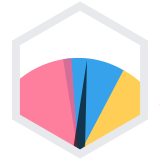

#  chartjs-gauge

Simple gauge chart for [Chart.js](https://www.chartjs.org/)

## Samples

- [Gauge Chart](https://codepen.io/haiiaaa/pen/rNVbmYy)
- [Gauge Chart with datalabels plugin](https://codepen.io/haiiaaa/pen/KKpYmRz)
- [Gauge Chart with datalabels plugin displaying labels](https://codepen.io/haiiaaa/pen/qBdwmyY)

## Install

- **yarn** install: `yarn add chart.js chartjs-gauge`
- **npm** install: `npm install --save chart.js chartjs-gauge`

<!---
## Documentation

- [Samples](https://codepen.io/???/)
--->
## Configuration Options

The gauge chart is based on the [Doughnut](https://www.chartjs.org/docs/latest/charts/doughnut.html#dataset-properties) type. It  defines the following additional configuration options. These options are merged with the global chart configuration options, `Chart.defaults.global`, to form the options passed to the chart.

| Name | Type | Default | Description
| ---- | ---- | ------- | -----------
| `needle.radiusPercentage`           | `number`                                                           | `2`                        | Needle circle radius as the percentage of the chart area width.
| `needle.widthPercentage`            | `number`                                                           | `3.2`                      | Needle width as the percentage of the chart area width.
| `needle.lengthPercentage`           | `number`                                                           | `80`                       | Needle length as the percentage of the interval between inner radius (0%) and outer radius (100%) of the arc.
| `needle.color`                      | [`Color`](https://www.chartjs.org/docs/latest/general/colors.html) | `'rgba(0, 0, 0, 1)'`       | The color of the needle.
| `valueLabel.display`                | `boolean`                                                          | `true`                     | If true, display the value label.
| `valueLabel.formatter`              | `function`                                                         | `Math.round`               | Returns the string representation of the value as it should be displayed on the chart.
| `valueLabel.fontSize`               | `number`                                                           | `undefined`                | The font size of the label.
| `valueLabel.color`                  | [`Color`](https://www.chartjs.org/docs/latest/general/colors.html) | `'rgba(255, 255, 255, 1)'` | The text color of the label.
| `valueLabel.backgroundColor`        | [`Color`](https://www.chartjs.org/docs/latest/general/colors.html) | `'rgba(0, 0, 0, 1)'`       | The background color of the label.
| `valueLabel.borderRadius`           | `number`                                                           | `5`                        | Border radius of the label.
| `valueLabel.padding.top`            | `number`                                                           | `5`                        | Top padding of the label.
| `valueLabel.padding.right`          | `number`                                                           | `5`                        | Right padding of the label.
| `valueLabel.padding.bottom`         | `number`                                                           | `5`                        | Bottom padding of the label.
| `valueLabel.padding.left`           | `number`                                                           | `5`                        | Left padding of the label.
| `valueLabel.bottomMarginPercentage` | `number`                                                           | `5`                        | Bottom margin as the percentage of the chart area width.


## Default Options

It is common to want to apply a configuration setting to all created gauge charts. The global gauge chart settings are stored in `Chart.defaults.gauge`. Changing the global options only affects charts created after the change. Existing charts are not changed.

For example, to configure all line charts with `radiusPercentage = 5` you would do:
```javascript
Chart.defaults.gauge.needle.radiusPercentage = 5;
```

## Dataset Properties

The gauge chart requires a value to be specified for the dataset. This is used to draw the needle for the dataset.

| Name       | Type     | Default     | Description
| ---------- | -------- | ----------- | -----------
| `value`    | `number` | `undefined` | Value used for the needle.
| `minValue` | `number` | `0`         | Used to offset the start value.


## Example

```javascript
var ctx = document.getElementById("canvas").getContext("2d");

var chart = new Chart(ctx, {
  type: 'gauge',
  data: {
    datasets: [{
      value: 0.5,
      minValue: 0,
      data: [1, 2, 3, 4],
      backgroundColor: ['green', 'yellow', 'orange', 'red'],
    }]
  },
  options: {
    needle: {
      radiusPercentage: 2,
      widthPercentage: 3.2,
      lengthPercentage: 80,
      color: 'rgba(0, 0, 0, 1)'
    },
    valueLabel: {
      display: true,
      formatter: (value) => {
        return '$' + Math.round(value);
      },
      color: 'rgba(255, 255, 255, 1)',
      backgroundColor: 'rgba(0, 0, 0, 1)',
      borderRadius: 5,
      padding: {
        top: 10,
        bottom: 10
      }
    }
  }
});
```

## License

chartjs-gauge is available under the [MIT license](https://opensource.org/licenses/MIT).
